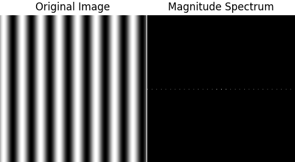

# dca0445-pdi

Aluno: Thiago Jordão

## Unidade I

Exercício 2.2 - Utilizando o programa da [Listagem 4](https://agostinhobritojr.github.io/tutorial/pdi/#ex-pixels) como referência, implemente um programa regions.cpp. Esse programa deverá solicitar ao usuário as coordenadas de dois pontos P1
 e P2
 localizados dentro dos limites do tamanho da imagem e exibir que lhe for fornecida. Entretanto, a região definida pelo retângulo de vértices opostos definidos pelos pontos P1
 e P2
 será exibida com o negativo da imagem na região correspondente.

 Resultado:


Utilizando o programa da [Listagem 4](https://agostinhobritojr.github.io/tutorial/pdi/#ex-pixels) como referência, implemente um programa trocaregioes.cpp. Seu programa deverá trocar os quadrantes em diagonal na imagem. Explore o uso da classe cv::Mat e seus construtores para criar as regiões que serão trocadas.

Resultado:


Exercício 3.2 - Utilizando o programa-exemplo filestorage.cpp como base, crie um programa que gere uma imagem de dimensões 256x256 pixels contendo uma senóide de 4 períodos com amplitude igual 127 desenhada na horizontal, semelhante àquela apresentada na [Figura 6](https://agostinhobritojr.github.io/tutorial/pdi/#fig_filestorage). Grave a imagem no formato YML e também exporte no formato PNG, como faz o programa-exemplo. Compare os arquivos gerados, extraindo uma linha correspondente de cada imagem gravada e comparando a diferença entre elas. Trace um gráfico da diferença calculada ao longo da linha correspondente extraída nas imagens.

Resultado:


## Unidade II

### [Exercício 15.2](https://agostinhobritojr.github.io/tutorial/pdi/dft.html#_exerc%C3%ADcios_14)

Utilizando o programa [exemplo/dft.cpp](https://agostinhobritojr.github.io/tutorial/pdi/exemplos/dft.cpp), calcule e apresente o espectro de magnitude da imagem [Figura 40, “Imagem senoidal com 256x256 pixels”](https://agostinhobritojr.github.io/tutorial/pdi/dft.html#fig_senoidal256).


```dft.py
import cv2
import numpy as np
import matplotlib.pyplot as plt

def swap_quadrants(image):
    image = image[:image.shape[0] & -2, :image.shape[1] & -2]
    centerX = image.shape[1] // 2
    centerY = image.shape[0] // 2
    A = image[:centerY, :centerX]
    B = image[:centerY, centerX:]
    C = image[centerY:, :centerX]
    D = image[centerY:, centerX:]
    tmp = A.copy()
    A[:] = D
    D[:] = tmp
    tmp = B.copy()
    B[:] = C
    C[:] = tmp

def calculate_magnitude_spectrum(image):
    dft_M = cv2.getOptimalDFTSize(image.shape[0])
    dft_N = cv2.getOptimalDFTSize(image.shape[1])
    padded = cv2.copyMakeBorder(image, 0, dft_M - image.shape[0], 0, dft_N - image.shape[1], cv2.BORDER_CONSTANT, value=0)
    complex_image = cv2.dft(np.float32(padded), flags=cv2.DFT_COMPLEX_OUTPUT)
    swap_quadrants(complex_image)
    magnitude = cv2.magnitude(complex_image[:, :, 0], complex_image[:, :, 1])
    magnitude += 1
    magnitude = np.log(magnitude)
    magnitude = cv2.normalize(magnitude, None, 0, 1, cv2.NORM_MINMAX)
    return magnitude

image = cv2.imread("senoide-256.png", cv2.IMREAD_GRAYSCALE)
magnitude_spectrum = calculate_magnitude_spectrum(image)
plt.subplot(121), plt.imshow(image, cmap="gray")
plt.title("Original Image"), plt.axis("off")
plt.subplot(122), plt.imshow(magnitude_spectrum, cmap="gray")
plt.title("Magnitude Spectrum"), plt.axis("off")
plt.show()
```

### Resultado:



Usando agora o [filestorage.cpp](https://agostinhobritojr.github.io/tutorial/pdi/exemplos/filestorage.cpp), mostrado na [Listagem 15, “filestorage.cpp](https://agostinhobritojr.github.io/tutorial/pdi/filestorage.html#ex-filestorage)” como referência, adapte o programa exemplos/dft.cpp para ler a imagem em ponto flutuante armazenada no arquivo YAML equivalente (ilustrado na [Listagem 18, “trecho do arquivo senoide-256.yml](https://agostinhobritojr.github.io/tutorial/pdi/filestorage.html#ex-senoideyml)”).

```filestorage.py
import cv2
import numpy as np
import matplotlib.pyplot as plt

def swap_quadrants(image):
    cx, cy = image.shape[1] // 2, image.shape[0] // 2
    image[:cy, :cx], image[cy:, cx:] = image[cy:, cx:].copy(), image[:cy, :cx].copy()
    image[:cy, cx:], image[cy:, :cx] = image[cy:, :cx].copy(), image[:cy, cx:].copy()

def main():
    fs = cv2.FileStorage("./senoide-256.yml", cv2.FILE_STORAGE_READ)
    image = fs.getNode("mat").mat()
    fs.release()

    complex_image = cv2.dft(image, flags=cv2.DFT_COMPLEX_OUTPUT)
    swap_quadrants(complex_image)

    planes = cv2.split(complex_image)
    magnitude = cv2.magnitude(*planes)
    magnitude += 1
    cv2.log(magnitude, magnitude)
    cv2.normalize(magnitude, magnitude, 0, 1, cv2.NORM_MINMAX)

    cv2.imshow("Original Image", image.astype(np.uint8))
    cv2.imshow("Magnitude Spectrum", magnitude)
    cv2.waitKey(0)
    cv2.destroyAllWindows()

if __name__ == "__main__":
    main()
```

### Resultado:


## Conclusão

Ao compararmos o espectro de magnitude gerado para a "Imagem senoidal com 256x256 pixels" com o valor teórico da Transformada de Fourier (TF) da senóide, observamos discrepâncias significativas. O espectro de magnitude apresentou múltiplos picos, contrariando o valor teórico que prevê apenas dois picos em f0 e -f0. Contudo, ao adaptar o programa exemplos/dft.cpp para ler a imagem em ponto flutuante armazenada no arquivo YAML, o espectro de magnitude gerado mostrou-se muito mais próximo do valor teórico. Isso se deve ao fato de que o formato YAML armazena informações em ponto flutuante, preservando mais detalhes e minimizando a perda de informação, contrariamente ao formato PNG que trabalha com valores inteiros, resultando em truncamento e perda de detalhes. Portanto, a utilização de um formato de arquivo que preserva a precisão dos dados de entrada é fundamental para obter resultados mais próximos do valor teórico esperado.

### [Exercício 16.2](https://agostinhobritojr.github.io/tutorial/pdi/dftfilter.html#_exerc%C3%ADcios_15)

Utilizando o programa [exemplos/dftfilter.cpp](https://agostinhobritojr.github.io/tutorial/pdi/exemplos/dftfilter.cpp) como referência, implemente o filtro homomórfico para melhorar imagens com iluminação irregular. Crie uma cena mal iluminada e ajuste os parâmetros do filtro homomórfico para corrigir a iluminação da melhor forma possível. Assuma que a imagem fornecida é em tons de cinza.

