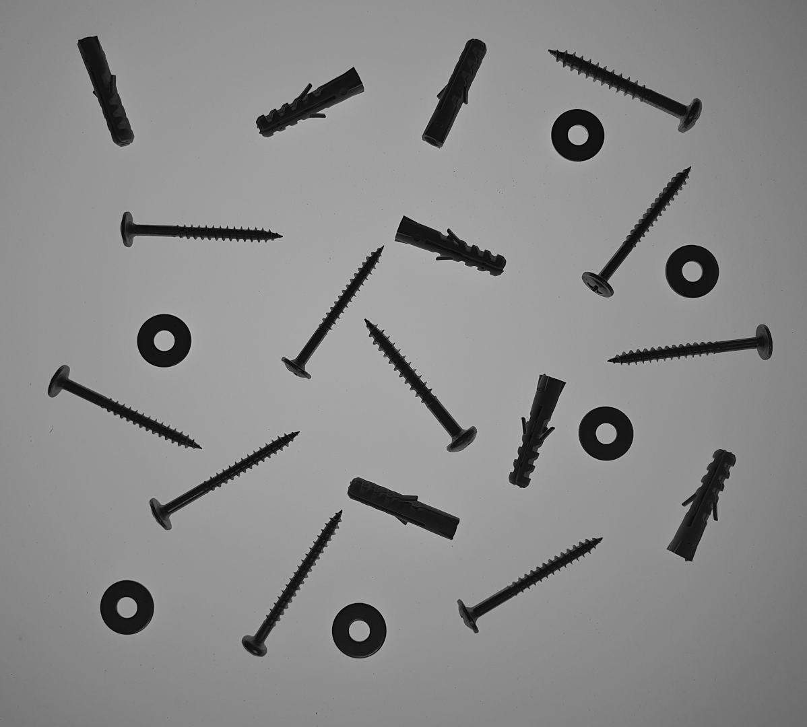
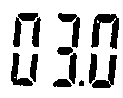
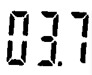

# dca0445-pdi

Aluno: Thiago Jordão

## Sumário

- [Unidade I](#unidade-i)
- [Unidade II](#unidade-ii)
- [Unidade III](#unidade-iii)

## Unidade I

Exercício 2.2 - Utilizando o programa da [Listagem 4](https://agostinhobritojr.github.io/tutorial/pdi/#ex-pixels) como referência, implemente um programa regions.cpp. Esse programa deverá solicitar ao usuário as coordenadas de dois pontos P1
 e P2
 localizados dentro dos limites do tamanho da imagem e exibir que lhe for fornecida. Entretanto, a região definida pelo retângulo de vértices opostos definidos pelos pontos P1
 e P2
 será exibida com o negativo da imagem na região correspondente.

 Resultado:


Utilizando o programa da [Listagem 4](https://agostinhobritojr.github.io/tutorial/pdi/#ex-pixels) como referência, implemente um programa trocaregioes.cpp. Seu programa deverá trocar os quadrantes em diagonal na imagem. Explore o uso da classe cv::Mat e seus construtores para criar as regiões que serão trocadas.

Resultado:


Exercício 3.2 - Utilizando o programa-exemplo filestorage.cpp como base, crie um programa que gere uma imagem de dimensões 256x256 pixels contendo uma senóide de 4 períodos com amplitude igual 127 desenhada na horizontal, semelhante àquela apresentada na [Figura 6](https://agostinhobritojr.github.io/tutorial/pdi/#fig_filestorage). Grave a imagem no formato YML e também exporte no formato PNG, como faz o programa-exemplo. Compare os arquivos gerados, extraindo uma linha correspondente de cada imagem gravada e comparando a diferença entre elas. Trace um gráfico da diferença calculada ao longo da linha correspondente extraída nas imagens.

Resultado:


## Unidade II

### [Exercício 15.2](https://agostinhobritojr.github.io/tutorial/pdi/dft.html#_exerc%C3%ADcios_14)

Utilizando o programa [exemplo/dft.cpp](https://agostinhobritojr.github.io/tutorial/pdi/exemplos/dft.cpp), calcule e apresente o espectro de magnitude da imagem [Figura 40, “Imagem senoidal com 256x256 pixels”](https://agostinhobritojr.github.io/tutorial/pdi/dft.html#fig_senoidal256).


```python
# dft.py
import cv2
import numpy as np
import matplotlib.pyplot as plt

def swap_quadrants(image):
    image = image[:image.shape[0] & -2, :image.shape[1] & -2]
    centerX = image.shape[1] // 2
    centerY = image.shape[0] // 2
    A = image[:centerY, :centerX]
    B = image[:centerY, centerX:]
    C = image[centerY:, :centerX]
    D = image[centerY:, centerX:]
    tmp = A.copy()
    A[:] = D
    D[:] = tmp
    tmp = B.copy()
    B[:] = C
    C[:] = tmp

def calculate_magnitude_spectrum(image):
    dft_M = cv2.getOptimalDFTSize(image.shape[0])
    dft_N = cv2.getOptimalDFTSize(image.shape[1])
    padded = cv2.copyMakeBorder(image, 0, dft_M - image.shape[0], 0, dft_N - image.shape[1], cv2.BORDER_CONSTANT, value=0)
    complex_image = cv2.dft(np.float32(padded), flags=cv2.DFT_COMPLEX_OUTPUT)
    swap_quadrants(complex_image)
    magnitude = cv2.magnitude(complex_image[:, :, 0], complex_image[:, :, 1])
    magnitude += 1
    magnitude = np.log(magnitude)
    magnitude = cv2.normalize(magnitude, None, 0, 1, cv2.NORM_MINMAX)
    return magnitude

image = cv2.imread("senoide-256.png", cv2.IMREAD_GRAYSCALE)
magnitude_spectrum = calculate_magnitude_spectrum(image)
plt.subplot(121), plt.imshow(image, cmap="gray")
plt.title("Original Image"), plt.axis("off")
plt.subplot(122), plt.imshow(magnitude_spectrum, cmap="gray")
plt.title("Magnitude Spectrum"), plt.axis("off")
plt.show()
```

### Resultado:


Usando agora o [filestorage.cpp](https://agostinhobritojr.github.io/tutorial/pdi/exemplos/filestorage.cpp), mostrado na [Listagem 15, “filestorage.cpp](https://agostinhobritojr.github.io/tutorial/pdi/filestorage.html#ex-filestorage)” como referência, adapte o programa exemplos/dft.cpp para ler a imagem em ponto flutuante armazenada no arquivo YAML equivalente (ilustrado na [Listagem 18, “trecho do arquivo senoide-256.yml](https://agostinhobritojr.github.io/tutorial/pdi/filestorage.html#ex-senoideyml)”).

```python
# filestorage.py
import cv2
import numpy as np
import matplotlib.pyplot as plt

def swap_quadrants(image):
    cx, cy = image.shape[1] // 2, image.shape[0] // 2
    image[:cy, :cx], image[cy:, cx:] = image[cy:, cx:].copy(), image[:cy, :cx].copy()
    image[:cy, cx:], image[cy:, :cx] = image[cy:, :cx].copy(), image[:cy, cx:].copy()

def main():
    fs = cv2.FileStorage("./senoide-256.yml", cv2.FILE_STORAGE_READ)
    image = fs.getNode("mat").mat()
    fs.release()

    complex_image = cv2.dft(image, flags=cv2.DFT_COMPLEX_OUTPUT)
    swap_quadrants(complex_image)

    planes = cv2.split(complex_image)
    magnitude = cv2.magnitude(*planes)
    magnitude += 1
    cv2.log(magnitude, magnitude)
    cv2.normalize(magnitude, magnitude, 0, 1, cv2.NORM_MINMAX)

    cv2.imshow("Original Image", image.astype(np.uint8))
    cv2.imshow("Magnitude Spectrum", magnitude)
    cv2.waitKey(0)
    cv2.destroyAllWindows()

if __name__ == "__main__":
    main()
```

### Resultado:


### Conclusão

Ao compararmos o espectro de magnitude gerado para a "Imagem senoidal com 256x256 pixels" com o valor teórico da Transformada de Fourier (TF) da senóide, observamos discrepâncias significativas. O espectro de magnitude apresentou múltiplos picos, contrariando o valor teórico que prevê apenas dois picos em f0 e -f0. Contudo, ao adaptar o programa exemplos/dft.cpp para ler a imagem em ponto flutuante armazenada no arquivo YAML, o espectro de magnitude gerado mostrou-se muito mais próximo do valor teórico. Isso se deve ao fato de que o formato YAML armazena informações em ponto flutuante, preservando mais detalhes e minimizando a perda de informação, contrariamente ao formato PNG que trabalha com valores inteiros, resultando em truncamento e perda de detalhes. Portanto, a utilização de um formato de arquivo que preserva a precisão dos dados de entrada é fundamental para obter resultados mais próximos do valor teórico esperado.

### [Exercício 16.2](https://agostinhobritojr.github.io/tutorial/pdi/dftfilter.html#_exerc%C3%ADcios_15)

Utilizando o programa [exemplos/dftfilter.cpp](https://agostinhobritojr.github.io/tutorial/pdi/exemplos/dftfilter.cpp) como referência, implemente o filtro homomórfico para melhorar imagens com iluminação irregular. Crie uma cena mal iluminada e ajuste os parâmetros do filtro homomórfico para corrigir a iluminação da melhor forma possível. Assuma que a imagem fornecida é em tons de cinza.


### [Exercício 18.3](https://agostinhobritojr.github.io/tutorial/pdi/canny.html#_exerc%C3%ADcios_17)

Utilizando os programas [exemplos/canny.cpp](https://agostinhobritojr.github.io/tutorial/pdi/exemplos/canny.cpp) e [exemplos/pontilhismo.cpp](https://agostinhobritojr.github.io/tutorial/pdi/exemplos/pontilhismo.cpp) como referência, implemente um programa cannypoints.cpp. A idéia é usar as bordas produzidas pelo algoritmo de Canny para melhorar a qualidade da imagem pontilhista gerada. A forma como a informação de borda será usada é livre.

```python
# canny.py
import cv2
import sys

# Initial slider values
top_slider = 10
top_slider_max = 200

# Load the image
image = cv2.imread(sys.argv[1], cv2.IMREAD_GRAYSCALE)
border = None

# Callback function for trackbar
def on_trackbar_canny(val):
    global border
    border = cv2.Canny(image, val, 3*val)
    cv2.imshow("Canny", border)

# Create window and trackbar
cv2.namedWindow("Canny", 1)
cv2.createTrackbar("Threshold inferior", "Canny", top_slider, top_slider_max, on_trackbar_canny)

# Initialize the canny display
on_trackbar_canny(top_slider)

# Wait for a key press and save the result
cv2.waitKey(0)
cv2.imwrite("cannyborders.png", border)
```

### Resultado:


```python
# canny_points.py
import cv2
import numpy as np
from copy import copy
import random

STEP = 5
JITTER = 3
RADIUS = 2

T1 = 130
edges = 0

image = cv2.imread("lena.png", 0)
height, width = image.shape
points = copy(image)

for i in range(height):
    for j in range(width):
        points[i, j] = 255

xrange = np.zeros(int(height/STEP))
yrange = np.zeros(int(width/STEP))

for xvalue in range(len(xrange)):
    xrange[xvalue] = xvalue

for yvalue in range(len(yrange)):
    yrange[yvalue] = yvalue

xrange = [value*STEP+STEP/2 for value in xrange]
yrange= [value*STEP+STEP/2 for value in yrange]

np.random.shuffle(xrange)

for i in xrange:
    np.random.shuffle(yrange)
    for j in yrange:
        x = int(i + random.randint(1, 2*JITTER-JITTER))
        y = int(j + random.randint(1, 2*JITTER-JITTER))
        if(x >= height):
                x = height-1
        if( y >= width):
                y = width-1
        gray = image[x,y]
        cv2.circle(points,
                (y, x),
                RADIUS,
                int(gray),
                -1,
                cv2.LINE_AA)

edges = cv2.Canny(points, T1, 3*T1) 

for i in range(height):
    for j in range(width):
        if(edges[i, j] != 0):
            gray = image[i,j]
            cv2.circle(points,
                    (j, i),
                    RADIUS,
                    int(gray),
                    -1,
                    cv2.LINE_AA)

cv2.imshow("pointillism", points)
cv2.imwrite("pointillism.png", points)
cv2.waitKey(0)     
cv2.destroyAllWindows()
```

### Resultado:


### [Exercício 19.2](https://agostinhobritojr.github.io/tutorial/pdi/kmeans.html#_exerc%C3%ADcios_18)

Utilizando o programa [kmeans.cpp](https://agostinhobritojr.github.io/tutorial/pdi/exemplos/kmeans.cpp) como exemplo prepare um programa exemplo onde a execução do código se dê usando o parâmetro nRodadas=1 e inciar os centros de forma aleatória usando o parâmetro KMEANS_RANDOM_CENTERS ao invés de KMEANS_PP_CENTERS. Realize 10 rodadas diferentes do algoritmo e compare as imagens produzidas. Explique porque elas podem diferir tanto.


```python
# kmeans.py
import cv2
import numpy as np

def main():
    
    NCLUSTERS = 8
    NROUNDS = 1
    
    image = cv2.imread("sushi.jpg", 1)
    height, width, channels = image.shape
    samples = np.zeros([height*width, 3], dtype = np.float32)
    
    for iteration in range(1, 11):  # Loop para executar o algoritmo 10 vezes
        count = 0
        for x in range(height):
            for y in range(width):
                samples[count] = image[x][y]
                count += 1
                
        compactness, labels, centers = cv2.kmeans(samples,
                                            NCLUSTERS, 
                                            None,
                                            (cv2.TERM_CRITERIA_EPS + cv2.TERM_CRITERIA_MAX_ITER, 10000, 0.0001), 
                                            NROUNDS, 
                                            cv2.KMEANS_RANDOM_CENTERS)
        centers = np.uint8(centers)
        res = centers[labels.flatten()]
        image2 = res.reshape((image.shape))
        
        # Salva cada imagem com um nome único
        cv2.imwrite(f"kmeans{iteration}.jpg", image2)
        
        # Opcional: Exibir a imagem
        # cv2.imshow(f"KMEANS {iteration}", image2)
        # cv2.waitKey(0)     
        # cv2.destroyAllWindows()

if __name__ == '__main__':
    main()
```

### Resultado:


### Conclusão

Ao executar o programa exemplo/kmeans.cpp, observamos que o algoritmo de K-Means pode diferir bastante entre as imagens produzidas. Isso ocorre porque o centro inicial é escolhido aleatoriamente, o que pode levar a resultados diferentes.

## Unidade III

### [Exercício 21.2 - Extração de contornos](https://agostinhobritojr.github.io/tutorial/pdi/contornos.html#_exerc%C3%ADcios_20)

Utilizando o programa contornos.cpp como referência, aplique-o na extração do contorno da imagem retangulos.png mostrada na [Figura 55](https://agostinhobritojr.github.io/tutorial/pdi/contornos.html#fig_retangulos), “Retângulos superpostos”. Quantos pontos são gerados para o contorno dos retângulos?

<p align='center'>
  
</p>

Modifique o programa para extrair os contornos internos das componentes conectadas presentes na imagem formas.png. Para isso, altere o parâmetro cv::CHAIN_APPROX_NONE para cv::CHAIN_APPROX_SIMPLE na função findContours(). O que acontece com os novos contornos extraídos? Mostre quantos pontos são gerados após a alteração e discuta como a modificação do parâmetro cv::CHAIN_APPROX_SIMPLE influencia na extração do contorno.

<p align='center'>
  
</p>

Mudança significativa no número de pontos, demonstra o impacto da simplificação dos contornos.

<p align='center'>
  
</p>

<p align='center'>
  
</p>

Impacto na estração de contornos, para o uso do cv::CHAIN_APPROX_SIMPLE age extraindo contornos que são mais leves e mais gerais, o que pode ser suficiente para muitas aplicações, já no uso do cv::CHAIN_APPROX_NONE oferece contornos completos com todos os detalhes, úteis para análises onde a precisão é crucial. 

Código utilizado para resolver esse exercício ➡️ [contornos.cpp](unidade-III/exercicio21.2/contornos.cpp)


### [Exercício 22.2 - Extração de características: Momentos de Hu para regiões](https://agostinhobritojr.github.io/tutorial/pdi/momentos-regioes.html#_exerc%C3%ADcios_21)

Utilizando o programa momentos-regioes.cpp como referência utilize as imagens pessoa.jpg e multidao.jpg e descubra em que posição a pessoa da primeira imagem se encontra na segunda imagem. Caso o programa fique lento, verifique se é possível utilizar a função cv::resize() para redimensionar as imagens e tornar o processamento mais rápido. Discuta as dificuldades encontradas na resolução do problema.

<div align='center'>
  
  <p align='center'> pessoa.png </p>
  
  <p align='center'> multidao.png </p>
  
  <p align='center'> resultado.png </p>
</div>

Se houver várias pessoas com aparência similar na imagem da multidão, o algoritmo pode ter dificuldades para encontrar a correspondência correta, um outro ponto pode ser a performance deslizar a janela sobre a imagem da multidão pode ser computacionalmente caro, especialmente para imagens grandes sendo assim dividir a imagem e paralelizar o cálculo pode ser uma solução para melhorar a eficiência.

Código utilizado para resolver esse exercício ➡️ [momentos-regions.cpp](unidade-III/exercicio22.2/momentos-regions.cpp)

### [Exercício 23.2 - Extração de características: Momentos de Hu para contornos](https://agostinhobritojr.github.io/tutorial/pdi/momentos-contornos.html#_exerc%C3%ADcios_22)

Modifique o programa momentos.cpp para extrair os momentos de todas as componentes conectadas presentes na imagem de modo a reproduzir o procedimento de obter o arquivo mostrado na [Listagem 75, “Exemplo de momentos extraídos da imagem formas.png.](https://agostinhobritojr.github.io/tutorial/pdi/momentos-contornos.html#exa_momentos_txt)”. Observe a imagem rotulada contornos-rotulados.png e os momentos extraídos para cada contorno. O que pode ser observado sobre a relação entre os momentos de Hu e a forma geométrica das componentes conectadas?

<div align='center'>
  
  <p align='center'> formas.png </p>

  
  <p align='center'> contornos-rotulados.png </p>

  
  <p align='center'> momentos.txt </p>
</div>

A análise dos momentos de Hu no arquivo momentos.txt demonstra como diferentes contornos e componentes conectadas na imagem contornos-rotulados.png podem ser comparados e classificados com base na forma geométrica. Essas comparações podem ser utilizadas para entender melhor a estrutura e as características das formas presentes na imagem, sendo úteis em diversas aplicações de visão computacional e análise de imagens.

Código utilizado para resolver esse exercício ➡️ [momentos-contornos.cpp](unidade-III/exercicio23.2/momentos-contornos.cpp)

### [Exercício 24.2 - Filtragem de forma com morfologia matemática](https://agostinhobritojr.github.io/tutorial/pdi/morfologia.html#_exerc%C3%ADcios_23)

Um sistema de captura de imagens precisa realizar o reconhecimento de carateres de um visor de segmentos para uma aplicação industrial. O visor mostra caracteres como estes apresentados na [Figura 60, “Caracteres do visor”](https://agostinhobritojr.github.io/tutorial/pdi/morfologia.html#fig_caracteres_visor).

<div align='center'>
    
</div>

Ocorre que o software de reconhecimento de padrões apresenta dificuldades de reconhecer os dígitos em virtude da separação existente entre os segmentos do visor. Idealmente, o software deveria reconhecer os dígitos como na [Figura 61, “Caracteres ideais para o reconhecimento”](https://agostinhobritojr.github.io/tutorial/pdi/morfologia.html#fig_caracteres_visor_reconhecidos).

<div align='center'>
    
</div>

Usando o programa morfologia.cpp como referência, crie um programa que resolva o problema da pré-filtragem de forma para reconhecimento dos caracteres usando operações morfológicas. Você poderá usar as imagens [digitos-1.png](https://agostinhobritojr.github.io/tutorial/pdi/figs/digitos-1.png), [digitos-2.png](https://agostinhobritojr.github.io/tutorial/pdi/figs/digitos-2.png), [digitos-3.png](https://agostinhobritojr.github.io/tutorial/pdi/figs/digitos-3.png), [digitos-4.png](https://agostinhobritojr.github.io/tutorial/pdi/figs/digitos-4.png) e [digitos-5.png](https://agostinhobritojr.github.io/tutorial/pdi/figs/digitos-5.png) para testar seu programa. Cuidado para deixar o ponto decimal separado dos demais dígitos para evitar um reconhecimento errado do número no visor.

<div style="display: flex; justify-content: center;">
    <div>
        
        
    </div>
    <div>
        
        
    </div>
    <div>
        
        
    </div>
    <div>
        
        
    </div>
    <div>
        
        
    </div>
</div>

Código utilizado para resolver esse exercício ➡️ [morfologia.cpp](unidade-III/exercicio24.2/morfologia.cpp)